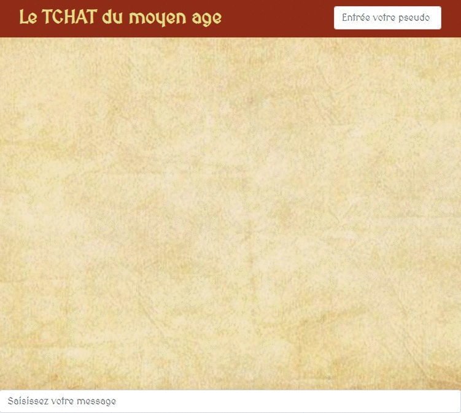

This project was bootstrapped with [Create React App](https://github.com/facebook/create-react-app).

## Objectif

Créer un Tchat version medieval

### Résultat : 

## Available Scripts

In the project directory, you can run:

### Technologies utilisées

- React JS
- Redux
- Bootstrap
- Socket.io

### Lancer le projet

1. `yarn install`.
2. Placer vous dans le dossier "server" puis `yarn install`,
3. Retourner dans votre dossier principal puis `yarn start:server`, le serveur est lancé.
4. lancer un second terminal, placer vous dans le projet `yarn start`, l'application est lancée.

